# 图书馆书籍定位系统 — 全项目架构分析

> **文档版本**: v2.0 | **更新日期**: 2026-04-05  
> **分析范围**: 全部源代码文件夹、文件职责、依赖关系、安全体系

---

## 一、项目全局鸟瞰

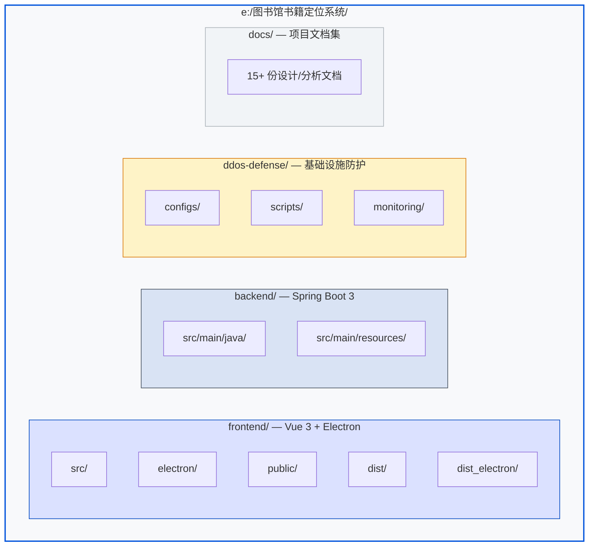

---

## 二、一级文件夹总览

| 文件夹 / 文件 | 类型 | 作用 |
|:---|:---|:---|
| `frontend/` | 📦 前端工程 | Vue 3 + Vite + Electron，包含全部页面视图、组件库、状态管理、路由、国际化、桌面宠物、诗词库 |
| `backend/` | 📦 后端工程 | Spring Boot 3 REST API 服务，提供认证、书籍、借阅、预约、统计、通知等全套接口 |
| `ddos-defense/` | 🛡️ 基础设施防护 | Nginx 限流配置、iptables 规则、自动化部署脚本、监控告警方案 |
| `docs/` | 📄 文档集 | 架构分析、开发指南、模块设计、实现总结等 15+ 份文档 |
| `README.md` | 📄 项目首页 | 项目介绍、快速上手、技术栈、API 文档、更新日志 |

---

## 三、系统架构总览

### 3.1 全链路请求流程

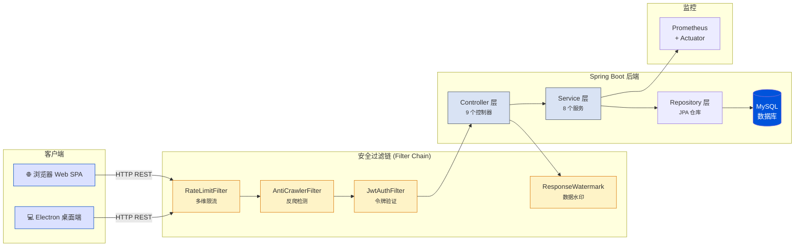

### 3.2 前后端通信协议

| 维度 | 具体值 |
|:---|:---|
| **协议** | HTTP REST (JSON) |
| **跨域** | Spring Security CORS 白名单配置 |
| **认证** | JWT Bearer Token (`Authorization: Bearer xxx`) |
| **接口前缀** | `/api/auth`, `/api/books`, `/api/borrows`, `/api/reservations`, `/api/statistics`, `/api/notifications`, `/api/search-history` |
| **降级策略** | 前端 `catch` 块捕获错误 → 使用本地 Fallback Mock 数据展示，用户体验不中断 |

> **松耦合设计**: 前端可完全独立运行（离线体验模式），后端不可达时自动降级到本地模拟数据。

---

## 四、后端架构深度剖析

### 4.1 五层架构总览

后端采用经典的 **Spring Boot 五层架构**，自上而下依赖方向单一：

```mermaid
graph TD
    subgraph L1["第1层：安全过滤链"]
        RATE["RateLimitFilter<br/><small>7层限流防御 · 392行</small>"]
        ANTI["AntiCrawlerFilter<br/><small>签名验证 · 路径分析</small>"]
        JWT_F["JwtAuthFilter<br/><small>Token 解析 · 上下文注入</small>"]
        WM["ResponseWatermark<br/><small>响应数据追溯</small>"]
    end

    subgraph L2["第2层：REST 控制器 (9个)"]
        AUTH["AuthController<br/><small>7KB · 认证全流程</small>"]
        BOOK["BookController<br/><small>6KB · 书籍接口</small>"]
        BORROW["BorrowController<br/><small>6KB · 借阅接口</small>"]
        STAT["StatisticsController<br/><small>7KB · 统计分析</small>"]
        CAPTCHA["CaptchaController<br/><small>12KB · 验证码系统</small>"]
        HONEY["HoneypotController<br/><small>7KB · 蜜罐陷阱</small>"]
        MORE_C["+ 3个业务控制器"]
    end

    subgraph L3["第3层：业务服务 (8个)"]
        USER_S["UserService<br/><small>356行 · 认证核心</small>"]
        BORROW_S["BorrowService<br/><small>406行 · 状态机</small>"]
        STAT_S["StatisticsService<br/><small>643行 · 分析引擎</small>"]
        PATTERN_S["RequestPatternAnalyzer<br/><small>333行 · 行为检测</small>"]
        MORE_S["+ 4个业务服务"]
    end

    subgraph L4["第4层：数据持久化"]
        REPO["3个 JPA Repository<br/><small>复杂聚合查询</small>"]
        ENTITY["8个 JPA Entity<br/><small>@Entity + 生命周期回调</small>"]
        DTO_L["20个 DTO<br/><small>请求/响应数据传输</small>"]
    end

    subgraph L5["第5层：基础设施"]
        DB[("MySQL 8.0")]
        SCHED["ScheduledTasks<br/><small>4个定时任务 + ShedLock</small>"]
        PROM["Prometheus + Actuator"]
    end

    L1 --> L2 --> L3 --> L4 --> L5

    style L1 fill:#fef3c7,stroke:#d97706
    style L3 fill:#dbe1ff,stroke:#0048c1
    style DB fill:#0053db,color:#fff
```

### 4.2 服务层内部依赖图

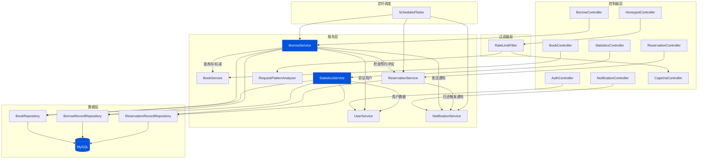

**关键设计观察**：`BorrowService` 是全系统**依赖最密集**的服务，它同时依赖 4 个其他服务（UserService、BookService、ReservationService、NotificationService），是借阅业务闭环的枢纽。

### 4.3 借阅状态机 — BorrowService (406 行)

#### 4.3.1 六状态状态转换图

```mermaid
stateDiagram-v2
    [*] --> PENDING : applyBorrow()
    PENDING --> APPROVED : approveBorrow(approved=true)
    PENDING --> REJECTED : approveBorrow(approved=false)
    APPROVED --> BORROWED : confirmPickup()
    BORROWED --> RETURNED : returnBook()
    BORROWED --> OVERDUE : checkOverdue() (定时任务)
    OVERDUE --> RETURNED : returnBook() (计算罚金)

    note right of PENDING : 前置校验:<br/>① 用户存在<br/>② 书籍存在<br/>③ 借阅数 < 5<br/>④ 无重复借阅<br/>⑤ 库存 > 0<br/>⑥ 无预约冲突
    note right of APPROVED : 审批通过时:<br/>原子扣减库存<br/>并发预约冲突检测
    note right of OVERDUE : 罚金计算:<br/>¥0.50/天 × 逾期天数<br/>向上取整(含当天)
    note left of REJECTED : 拒绝原因:<br/>· 库存不足<br/>· 预约阻断<br/>· 持书超限
```

#### 4.3.2 借阅全链路数据流

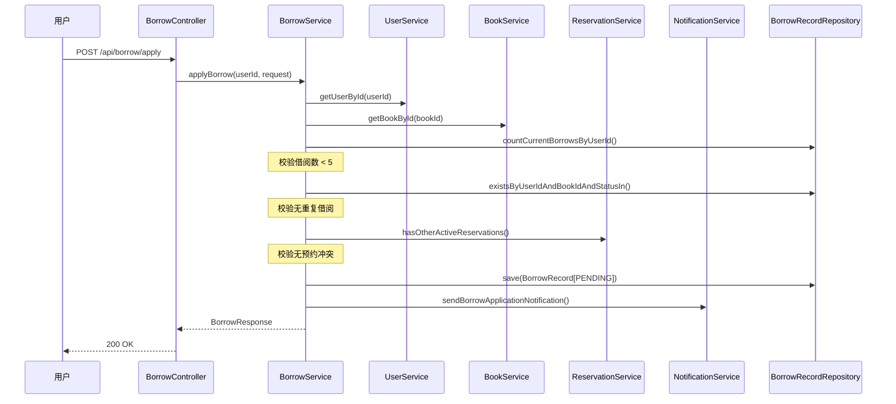

#### 4.3.3 业务常量规则表

| 常量 | 值 | 说明 |
|:---|---:|:---|
| `MAX_BORROW_COUNT` | 5 | 每用户最大持书量（含 PENDING） |
| `DEFAULT_BORROW_DAYS` | 30 | 默认借阅天数 |
| `RENEW_DAYS` | 15 | 续借延长天数 |
| `MAX_RENEW_COUNT` | 1 | 最大续借次数 |
| `FINE_PER_DAY` | ¥0.50 | 逾期每日罚金 |

#### 4.3.4 并发安全机制

| 场景 | 风险 | 解决方案 |
|:---|:---|:---|
| 同时借阅同一本书 | 库存超卖 | `decreaseAvailableCopies()` 原子扣减 |
| 审批时库存已被其他预约占用 | 状态不一致 | `approveBorrow` 内 try-catch 降级为 REJECTED |
| 同用户重复提交借阅 | 重复记录 | `existsByUserIdAndBookIdAndStatusIn()` 校验 |
| 审批时用户持书已满 | 超限 | 审批前二次 `countCurrentBorrowsByUserId()` 检查 |

### 4.4 RateLimitFilter — 七层纵深限流 (392 行)

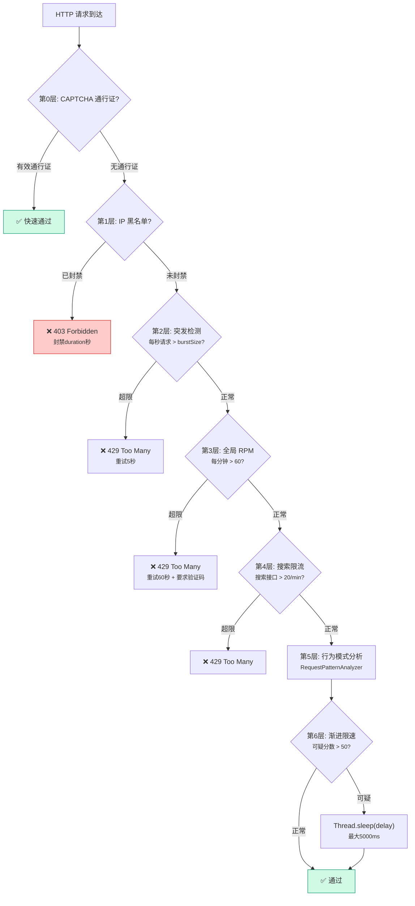

#### 核心数据结构

| 数据结构 | 类型 | 用途 |
|:---|:---|:---|
| `globalCounters` | `ConcurrentHashMap<IP, SlidingWindowCounter>` | 每 IP 全局请求计数（1 分钟窗口） |
| `searchCounters` | `ConcurrentHashMap<IP, SlidingWindowCounter>` | 搜索接口专用计数 |
| `burstTrackers` | `ConcurrentHashMap<IP, BurstTracker>` | 每秒突发请求检测 |
| `bannedIps` | `ConcurrentHashMap<IP, Long>` | IP 黑名单（解封时间戳） |
| `rateLimitTriggers` | `ConcurrentHashMap<IP, AtomicInteger>` | 限流触发累计（≥3 次自动封禁） |

**SlidingWindowCounter** 算法：以秒为粒度分 slot，每次请求 `slots[now/1000]++`，定期清除窗口外旧 slot，窗口内求和与阈值比较。

### 4.5 RequestPatternAnalyzer — 五维行为检测 (333 行)

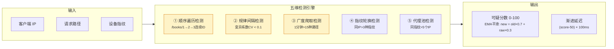

#### 检测算法详解

| 检测维度 | 算法 | 阈值 → 分数 |
|:---|:---|:---|
| **顺序遍历** | 提取路径末尾数字 ID，检测 `id == lastId + 1` 的连续次数 | ≥3: +10分, ≥5: +25分, ≥8: +40分 |
| **规律间隔** | 相邻请求时间差序列 → 计算变异系数 `CV = σ/μ` | CV<0.05: +35分, <0.1: +20分, <0.2: +8分 |
| **广度爬取** | 路径归一化（ID→`{id}`）后统计 1 分钟内唯一路径数 | >15种: +15分, >20种: +30分 |
| **指纹轮换** | `ConcurrentHashMap<IP, Set<FP>>` 记录同 IP 使用的指纹数 | >3种: +(n-3)×15, 上限40分 |
| **代理池** | `ConcurrentHashMap<FP, Set<IP>>` 记录同指纹出现的 IP 数 | >5个: +(n-5)×10, 上限30分 |

**指数移动平均 (EMA)** 平滑：`newScore = oldScore × 0.7 + rawScore × 0.3`，防止单次高分误判。

### 4.6 UserService — 认证与安全加固 (356 行)

#### 4.6.1 登录流程（防时序攻击）

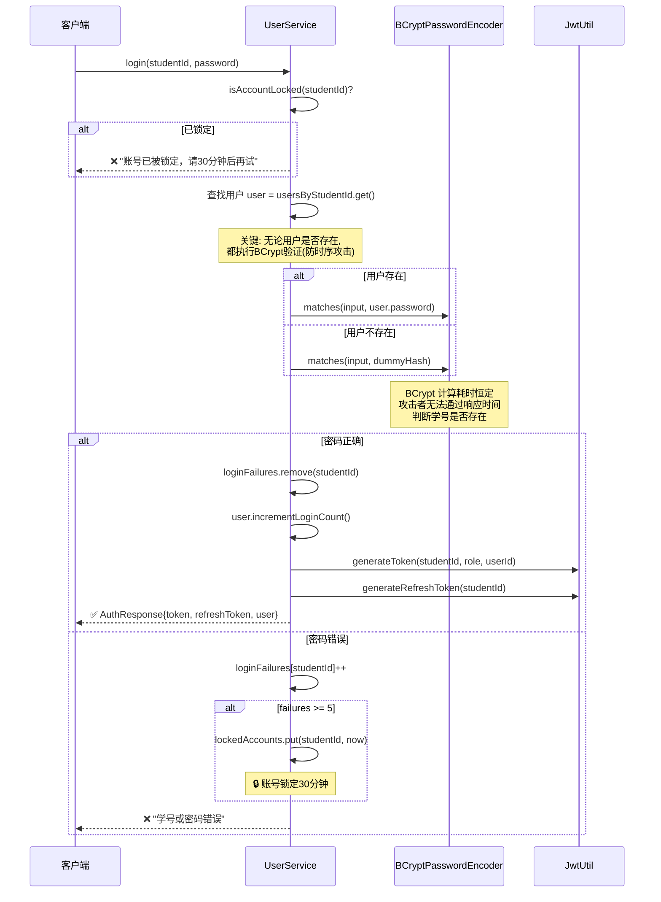

#### 4.6.2 认证安全特性

| 特性 | 实现 |
|:---|:---|
| **密码存储** | BCrypt (cost factor 10)，不可逆哈希 |
| **防时序攻击** | 用户不存在时仍执行 BCrypt.matches (标准 Dummy Hash) |
| **防暴力破解** | 5 次失败 → 账号锁定 30 分钟 |
| **密码强度** | 6-20 位，必须含数字 + 字母 |
| **并发注册** | `synchronized` 块保护学号/邮箱唯一性检查 |
| **密码变更** | 新密码不可等于旧密码 + `invalidateAllUserTokens()` |
| **Token 策略** | 普通: 24h Token + 7d Refresh / 记住我: 7d Token + 30d Refresh |
| **日志审计** | 成功/失败/锁定事件全部写入 LoginLog |

### 4.7 StatisticsService — 数据分析引擎 (643 行, 最大服务)

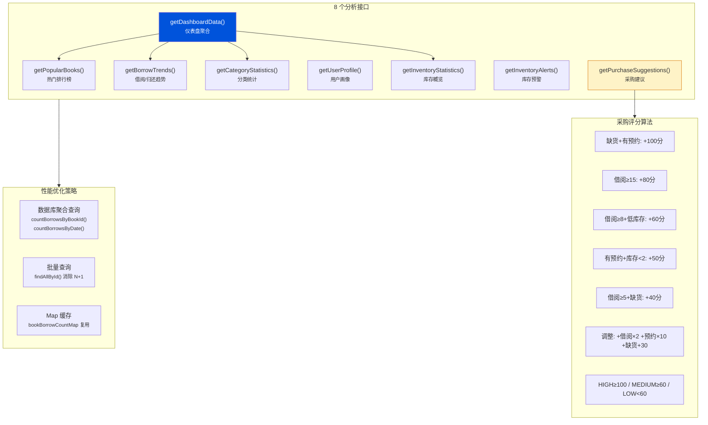

#### 采购建议评分公式

```
BaseScore = 权重(缺货100/高频80/中频60/预约50/低频40)
AdjustedScore = BaseScore + borrowCount×2 + reservationCount×10 + (缺货?30:低库存?15:0)
FinalScore = min(AdjustedScore, 1000)

Priority: HIGH(≥100) | MEDIUM(≥60) | LOW(<60)
SuggestedCopies = currentCopies + max(预约人数, 2)  // 缺货场景
EstimatedBudget = totalAdditionalCopies × ¥50/本
```

### 4.8 SecurityConfig — Spring Security 安全配置 (93 行)

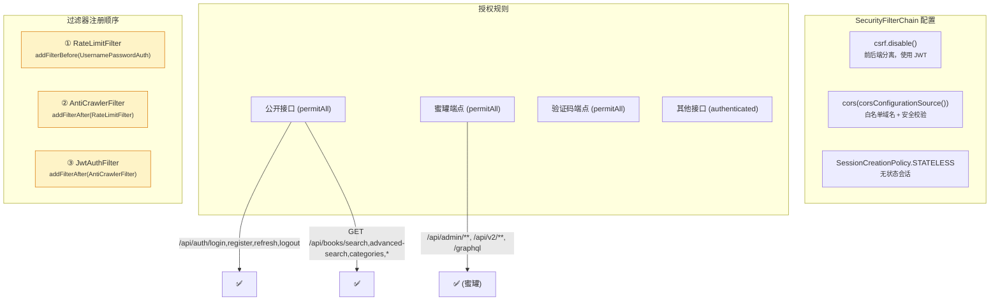

**CORS 安全加固**：
- ❌ 拒绝通配符 `*` 配置（抛出 `IllegalArgumentException`）
- ✅ 强制要求 `http://` 或 `https://` 协议前缀
- ✅ 暴露限流响应头 `Retry-After`, `X-RateLimit-Remaining`, `X-Captcha-Required`

### 4.9 定时任务系统 — ScheduledTasks + ShedLock (114 行)

| 任务 | Cron 表达式 | 执行时间 | ShedLock 配置 | 调用服务 |
|:---|:---|:---|:---|:---|
| `checkOverdue` | `0 0 1 * * ?` | 每天 01:00 | 最长锁 10m / 最短锁 1m | `BorrowService.checkOverdue()` |
| `checkExpiredReservations` | `0 0 2 * * ?` | 每天 02:00 | 最长锁 10m / 最短锁 1m | `ReservationService.checkExpiredReservations()` |
| `sendDueDateReminders` | `0 0 9 * * ?` | 每天 09:00 | 最长锁 10m / 最短锁 1m | 查询 3 天内到期记录 → 通知 |
| `sendUrgentDueDateReminders` | `0 0 10 * * ?` | 每天 10:00 | 最长锁 10m / 最短锁 1m | 查询 1 天内到期记录 → 紧急通知 |

**ShedLock 作用**：在集群部署环境下，同一时刻只有一个实例执行定时任务，避免重复发送通知。

### 4.10 数据传输层 — DTO 清单 (20 个类)

| 类别 | DTO | 字段数 | 用途 |
|:---|:---|---:|:---|
| **认证** | `LoginRequest` | 3 | 学号+密码+记住我 |
| | `RegisterRequest` | 6 | 学号+用户名+密码+确认密码+邮箱+手机 |
| | `AuthResponse` | 4 | Token+RefreshToken+过期时间+用户信息 |
| | `UserInfo` | 7 | 用户 ID+学号+用户名+邮箱+手机+角色+头像 |
| | `UserDTO` | 多字段 | 管理端用户详情 |
| **借阅** | `BorrowRequest` | 2 | 书籍 ID+备注 |
| | `BorrowResponse` | 14 | 全部借阅字段（含罚金/续借/逾期） |
| | `ReservationRequest` | 1 | 书籍 ID |
| | `ReservationResponse` | 7 | 预约详情 |
| **统计** | `PopularBookDTO` | 6 | 热门书籍排行 |
| | `BorrowTrendDTO` | 3 | 日期+借阅数+归还数 |
| | `CategoryStatisticsDTO` | 5 | 分类统计 |
| | `UserProfileDTO` | 7 | 用户画像 |
| | `InventoryStatisticsDTO` | 6 | 库存统计 |
| | `DashboardDataDTO` | 6 | 仪表盘聚合 |
| | `InventoryAlertDTO` | 12 | 单条预警信息 |
| | `InventoryAlertSummaryDTO` | 7 | 预警汇总 |
| | `PurchaseSuggestionDTO` | 14 | 单条采购建议 |
| | `PurchaseSuggestionSummaryDTO` | 7 | 采购汇总 |
| **通用** | `ApiResponse<T>` | 3 | 统一响应封装: success+message+data |

### 4.11 数据模型 — JPA 实体清单

| 实体 | 表名 | 核心字段 | 特殊机制 |
|:---|:---|:---|:---|
| `User` | users | id, studentId, username, password, role, status, loginCount, lastLoginTime | `@PrePersist/@PreUpdate` 时间戳 |
| `Book` | books | id, title, author, isbn, location, category, totalCopies, availableCopies | 原子扣减/恢复库存 |
| `BorrowRecord` | borrow_records | userId, bookId, borrowDate, dueDate, returnDate, status, renewCount, fineAmount | **6 状态枚举** + BigDecimal 罚金 |
| `ReservationRecord` | reservation_records | userId, bookId, reservationDate, expireDate, status, queuePosition | 状态枚举 (WAITING/NOTIFIED/FULFILLED/EXPIRED/CANCELLED) |
| `NotificationRecord` | notification_records | userId, title, message, type, isRead, createdAt | 推送类型枚举 |
| `SearchHistoryRecord` | search_history | userId, keyword, searchDate | 简单 CRUD |
| `LoginLog` | login_logs | userId, studentId, ipAddress, userAgent, status, failReason | 审计追踪 |
| `BookRecord` | book_records | 扩展书籍字段 | 定价/出版社等附加信息 |

### 4.12 后端代码量统计

| 文件 | 行数 | 体积 | 定位 |
|:---|---:|---:|:---|
| `StatisticsService.java` | 643 | 23KB | 最大服务 · 8 维数据分析引擎 |
| `BorrowService.java` | 406 | 17KB | 核心业务 · 6 状态借阅状态机 |
| `RateLimitFilter.java` | 392 | 15KB | 7 层纵深限流防御 |
| `UserService.java` | 356 | 13KB | 认证核心 · 防时序攻击 |
| `RequestPatternAnalyzer.java` | 333 | 11KB | 5 维行为模式检测 |
| `CaptchaController.java` | ~300 | 12KB | 验证码生成/校验 |
| `HoneypotController.java` | ~180 | 7KB | 蜜罐诱捕端点 |
| `AuthController.java` | ~180 | 7KB | 认证 REST 接口 |
| `StatisticsController.java` | ~180 | 7KB | 统计 REST 接口 |
| `ScheduledTasks.java` | 114 | 4KB | 4 个定时任务 |
| `SecurityConfig.java` | 93 | 5KB | Spring Security 配置 |
| `BorrowRecord.java` | 106 | 3KB | 借阅 JPA 实体 |
| **后端源码合计** | **~4,000+** | **~150KB+** | 10 个包 · 40+ 类 |

### 4.13 Maven 依赖矩阵

| 依赖 | 版本 | 用途 |
|:---|:---|:---|
| `spring-boot-starter-web` | 3.2.4 | REST API 框架 |
| `spring-boot-starter-security` | 3.2.4 | 安全框架 · 过滤器链 · CORS |
| `spring-boot-starter-data-jpa` | 3.2.4 | ORM 持久化 · Repository 查询 |
| `spring-boot-starter-validation` | 3.2.4 | `@Valid` 参数校验 |
| `spring-boot-starter-actuator` | 3.2.4 | 健康检查 · 指标暴露 |
| `mysql-connector-j` | 运行时 | MySQL 8.0 驱动 |
| `jjwt-api/impl/jackson` | 0.12.3 | JWT 令牌生成/验证/失效 |
| `spring-security-crypto` | 内置 | BCryptPasswordEncoder |
| `lombok` | 编译时 | `@Data` `@Slf4j` `@RequiredArgsConstructor` |
| `shedlock-spring` | 5.10.0 | 分布式定时任务锁 |
| `micrometer-registry-prometheus` | 运行时 | Prometheus 指标采集 → Grafana |

---

## 五、前端架构深度剖析

### 5.1 六层架构总览

前端采用清晰的 **六层架构** 分层设计，每一层职责单一、依赖方向自上而下：

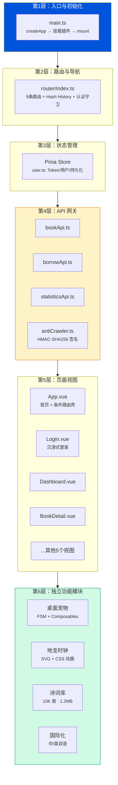

### 5.2 应用启动链与初始化序列

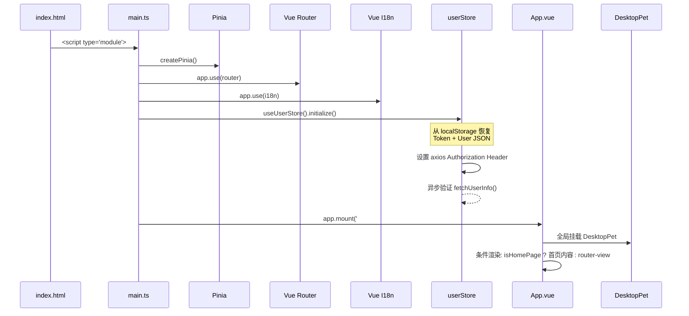

**`main.ts`** 的初始化链（21行，极其精炼）：
1. `createPinia()` → 注册状态管理
2. `app.use(router)` → 注册路由系统（Hash History，Electron 兼容）
3. `app.use(i18n)` → 注册国际化（自动检测 `navigator.language`）
4. `useUserStore().initialize()` → **同步恢复** localStorage 中的 Token/User，**异步验证** Token 有效性
5. `app.mount('#app')` → 挂载应用

### 5.3 App.vue — 混合渲染机制 (3344 行)

`App.vue` 是整个前端最大的文件 (~99KB)，它同时承担 **首页视图** 和 **全局路由壳** 两个角色：

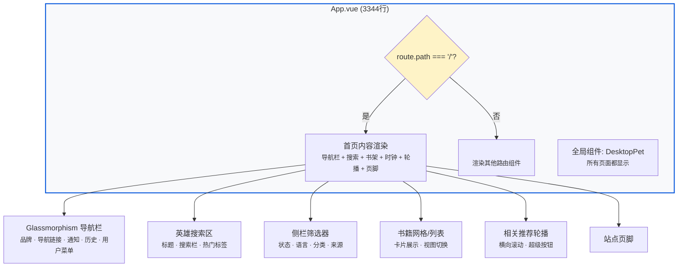

#### App.vue 代码量分布

| 区域 | 约行数 | 占比 | 说明 |
|:---|---:|---:|:---|
| `<template>` | ~427 | 12.8% | 首页 HTML 结构 + 条件路由 + 桌面宠物 |
| `<script setup>` | ~900 | 26.9% | 业务逻辑：搜索、通知、历史、按钮交互、Web Audio、粒子 |
| `<style>` | ~2000 | 59.8% | 全局 CSS：设计系统变量 + 所有组件样式 + 动画关键帧 |

#### 首页超级按钮交互系统

App.vue 中的 "查看全部" 按钮实现了 **12 种独立的微交互效果**，是全前端最复杂的单一交互元素：

| 交互 | 技术实现 | 触发方式 |
|:---|:---|:---|
| 3D 透视倾斜 | `perspective(600px) rotateX/Y` CSS transform | `mousemove` |
| 磁性吸附 | 计算鼠标距按钮中心距离，`translate()` 偏移 | `mousemove` (父区域) |
| 光标聚光灯 | `radial-gradient` 动态跟随 | `mousemove` |
| 点击涟漪 | 动态 DOM 元素 + `animation: expand` | `click` |
| 爆裂粒子 | 8 粒子向 8 方向飞射 | `click` |
| 轨迹尾巴 | 节流式生成拖尾圆点 | `mousemove` |
| 充能进度条 | `setInterval` 递增宽度 | `mousedown` (长按) |
| 弹性形变 | 基于鼠标速度计算 `scaleX/Y` | `mousemove` 速度检测 |
| 双击冲击波 | 扩展环 CSS 动画 | `dblclick` |
| 右键能量漩涡 | 12 粒子螺旋汇聚 | `contextmenu` |
| 幽灵残影 | 磁性运动时生成半透明副本 | 磁性偏移 > 2px |
| 文字故障 | 随机替换字符 → 逐帧还原 | `mouseenter` |
| 心跳脉冲 | 周期性 `scale(1.03)` 跳动 | 空闲 4s 自动 |
| 音效反馈 | Web Audio API 合成正弦/三角波 | `hover` + `click` |
| 边缘光晕 | `conic-gradient` 跟随角度 | `mousemove` |

### 5.4 状态管理 — Pinia User Store (258 行)

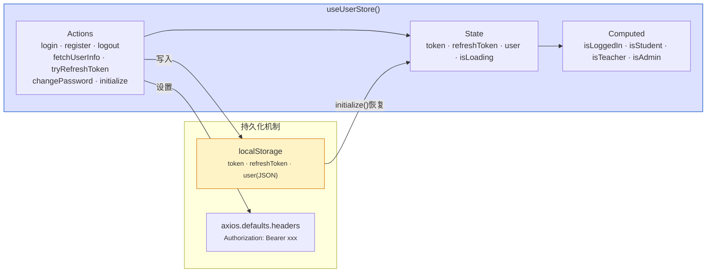

**Token 刷新机制**：
1. `fetchUserInfo()` 失败 → 调用 `tryRefreshToken()`
2. 使用 `refreshToken` 请求 `/api/auth/refresh`
3. 成功 → 更新 Token + User + localStorage + axios Header
4. 失败 → 调用 `logout()` → 清除所有本地数据

### 5.5 API 网关层 — 三层拦截器链

每个 API 模块（`bookApi`、`borrowApi`、`statisticsApi`）都创建独立的 Axios 实例，并注册 **两层拦截器**：

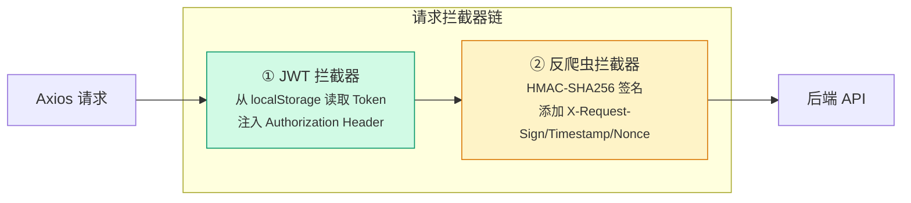

#### 反爬虫签名算法 (`antiCrawler.ts`, 152 行)

```
签名 = HMAC-SHA256(timestamp + path + nonce, secret)
```

| 步骤 | 实现 |
|:---|:---|
| 密钥存储 | XOR 混淆分散 + 字符偏移编码，运行时还原缓存 |
| Nonce 生成 | `crypto.getRandomValues()` 生成 16 位随机字符串 |
| 签名计算 | Web Crypto API `crypto.subtle.sign('HMAC', key, data)` |
| 头部注入 | `X-Request-Sign` + `X-Request-Timestamp` + `X-Request-Nonce` |
| 降级策略 | 非 HTTPS 环境签名失败时静默跳过，不阻塞请求 |

#### API 模块接口清单

| 模块 | 文件 | 接口数 | 类型定义数 | 说明 |
|:---|:---|---:|---:|:---|
| 书籍 | `bookApi.ts` | 8 | 4 | 搜索/详情/评论/历史/推荐/分类 |
| 借阅 | `borrowApi.ts` | 7 | 4 | 借阅申请/归还/续借/历史/预约 |
| 统计 | `statisticsApi.ts` | 8 | 8 | 热门/趋势/分类/画像/库存/仪表盘/预警/采购 |
| 反爬 | `antiCrawler.ts` | 3 | 0 | 签名生成/拦截器创建/注册 |

### 5.6 Login.vue — 沉浸式水墨登录界面 (1910 行, 72KB)

Login.vue 是整个前端**视觉复杂度最高**的单一组件，融合了 Canvas 渲染、SVG 矢量、CSS 动画和交互式粒子系统。

#### 5.6.1 视觉层级架构 (Z-index 从底到顶)

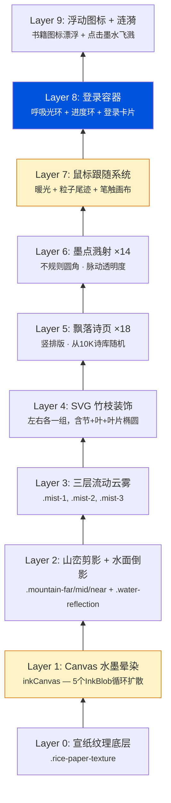

#### 5.6.2 Canvas 双画布渲染管线

Login.vue 维护 **两个独立的 Canvas 渲染循环**，均通过 `requestAnimationFrame` 驱动：

| 画布 | ref | 渲染内容 | 帧逻辑 |
|:---|:---|:---|:---|
| **水墨晕染** | `inkCanvas` | 5 个 InkBlob，每个由 5 个偏移圆组成 | 每帧：增长半径 → 到达 maxRadius 后重置位置 → 计算径向渐变 → 多层叠绘 |
| **毛笔笔触** | `brushCanvas` | 鼠标轨迹的平滑曲线 | 每帧：老化所有点 → 过期删除 → 相邻点 `quadraticCurveTo` 绘制 → 透明度衰减 |

```
InkBlob 数据结构：
{x, y, radius, maxRadius, opacity, speed, driftX, phase}

BrushPoint 数据结构：
{x, y, age, size}   // age: 0→1 后删除
```

#### 5.6.3 粒子系统汇总

| 粒子系统 | 数量 | 生命周期 | 触发方式 |
|:---|---:|:---|:---|
| 鼠标尾迹粒子 | ≤20 | 1s 自动销毁 | `mousemove` 节流 50ms |
| 环境漂浮粒子 | 30 | 8-20s 循环 | 页面加载自动创建 |
| 登录成功烟花 | 40 | 1.5s 一次性 | `handleSubmit` 成功后 |
| 点击墨水飞溅 | 3-5/次 | 0.8s 自动销毁 | 页面任意位置 `click` |
| 点击涟漪圆环 | 1/次 | 0.8s 自动销毁 | 页面任意位置 `click` |
| 按钮悬停粒子 | 6 | CSS 动画循环 | 提交按钮 `mouseenter` |

#### 5.6.4 表单交互数据流

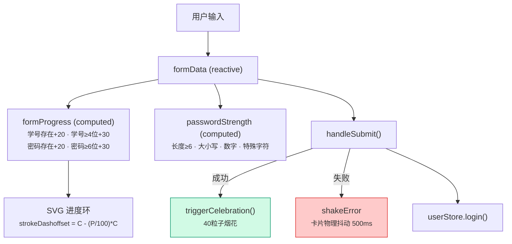

### 5.7 桌面宠物系统 — 19 状态有限状态机 (FSM)

桌面宠物 "鸡蛋仔" 采用 **Composable 三层分离架构**：

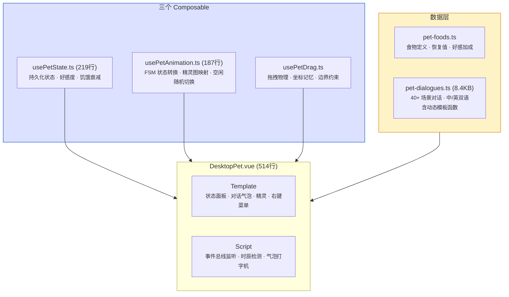

#### 5.7.1 宠物状态机 — 19 个动作状态

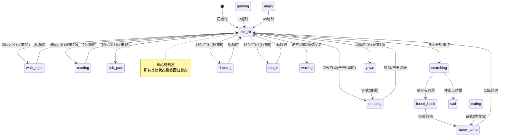

#### 5.7.2 宠物状态持久化

| 属性 | 类型 | 默认值 | 说明 |
|:---|:---|:---|:---|
| `name` | string | "鸡蛋仔" | 宠物名 |
| `mood` | 0-100 | 80 | 心情值，饥饿时自动衰减 |
| `hunger` | 0-100 | 70 | 饥饿值，每 10 分钟 -1 |
| `affinity` | 0-∞ | 0 | 好感度，决定升级称谓 |
| `position` | {x, y} | {-1, -1} | 拖拽位置，-1 表示默认右下角 |
| `totalInteractions` | number | 0 | 总互动次数 |
| `createdAt` | timestamp | Date.now() | 创建时间，用于计算"相伴天数" |

好感度等级：
- 📗 0-19: 实习馆员 → 📘 20-49: 见习馆员 → 📙 50-99: 正式馆员 → 📕 100-199: 资深馆员 → 📔 200+: 首席馆员

#### 5.7.3 事件总线 — App ↔ Pet 通信

宠物通过 Vue `provide/inject` 管道监听 App 层事件：

| 事件 | 数据 | 宠物反应 |
|:---|:---|:---|
| `search:start` | — | 切换到 `searching` 动作 + 搜索对话 |
| `search:complete` | `{books, count}` | 有结果: `found_book` → `happy_jump` + 动态播报; 无结果: `sad` |
| `filter:change` | `{category}` | `waving` + 分类评论 |
| `lang:switch` | — | `waving` + 切语言对话 |
| `notif:new` | `{title}` | `notification` + 通知播报 |
| `offline:detected` | — | `sad` + 离线安慰 |
| `offline:restored` | — | `happy_jump` + 恢复庆祝 |

### 5.8 数据可视化 — Dashboard.vue (498 行)

Dashboard 采用 **ECharts 动态导入 + 四图表并行渲染** 模式：

```mermaid
graph TD
    MOUNT["onMounted"] -->|"动态 import('echarts')"| ECHARTS["ECharts 实例"]
    MOUNT --> API["statisticsApi.getDashboardData()"]
    API --> DATA["DashboardData 响应"]
    DATA --> INIT["initCharts()"]

    INIT --> TREND["borrowTrendChart<br/><small>折线图: 借阅/归还趋势</small>"]
    INIT --> POPULAR["popularBooksChart<br/><small>横向柱状图: 热门排行</small>"]
    INIT --> CAT["categoryChart<br/><small>分组柱状图: 分类对比</small>"]
    INIT --> PIE["categoryRateChart<br/><small>饼图: 分类借阅率</small>"]

    UNMOUNT["onUnmounted"] -->|"dispose()"| TREND
    UNMOUNT -->|"dispose()"| POPULAR
    UNMOUNT -->|"dispose()"| CAT
    UNMOUNT -->|"dispose()"| PIE

    style ECHARTS fill:#fef3c7,stroke:#d97706
```

**关键设计决策**：
- ECharts 通过 `await import('echarts')` 按需加载，避免打包体积膨胀
- 每次 `loadData()` 前先 `dispose()` 旧实例，防止内存泄漏
- `window.addEventListener('resize')` + 四实例 `.resize()` 实现响应式适配

### 5.9 路由系统深度分析

```mermaid
graph TD
    subgraph RouterConfig["router/index.ts (98行)"]
        HASH["createWebHashHistory()<br/><small>Hash模式: 兼容 Electron file:// 协议</small>"]
        LAZY["8个懒加载路由<br/><small>() => import('../views/XXX.vue')</small>"]
        STUB["HomeStub 空组件<br/><small>defineComponent({ render: () => h('div') })</small>"]
        GUARD["beforeEach 守卫<br/><small>认证检查 + 重定向逻辑</small>"]
    end

    HASH --> LAZY
    LAZY --> STUB
    GUARD -->|"requiresAuth && !loggedIn"| LOGIN_REDIRECT["→ /login?redirect=原路径"]
    GUARD -->|"路由是Login && loggedIn"| HOME_REDIRECT["→ /"]

    style HASH fill:#fef3c7,stroke:#d97706
```

**为什么选择 Hash History？** — Electron 生产模式下通过 `file://` 协议加载 `dist/index.html`，HTML5 History API 的 `pushState` 无法在 `file://` 协议下工作，Hash History（`#/path`）在所有环境下都能正常运作。

**为什么首页是 HomeStub？** — App.vue 通过 `computed(() => route.path === '/')` 判断当前路由，当路径为 `/` 时直接渲染内嵌的首页内容（导航栏、搜索、书架），避免了将 3000+ 行代码拆分到独立组件的重构成本，同时 `<router-view v-else />` 处理其他所有路由。

### 5.10 样式架构

| 文件 | 行数 | 作用域 | 说明 |
|:---|---:|:---|:---|
| `App.vue <style>` | ~2000 | **全局** (无 scoped) | 首页所有组件样式 + CSS 变量 + 按钮动画 |
| `Login.vue <style>` | ~1000 | scoped | 水墨登录页 10 层视觉效果 + 所有粒子关键帧 |
| `pet.css` | 420+ | 全局导入 | 宠物精灵动画 · 19 种状态各自 @keyframes · 气泡样式 |
| `dizhi.css` | 266 | 全局导入 | 地支设计系统：12×3 HSL 色变量 + 琉璃珠效果 |
| `Dashboard.vue <style>` | ~120 | scoped | 统计卡片 + 图表容器布局 |
| `BookDetail.vue <style>` | ~490 | scoped | 详情页双栏布局 + 评论表单 |
| 其他 View `<style>` | 各~100 | scoped | 各页面独立样式 |

**设计系统特点**：
- **CSS 变量驱动**：全局 `:root` 定义 5 级 Surface 层级色彩
- **Glassmorphism**：导航栏 `backdrop-filter: blur(20px)` + `rgba` 半透明
- **响应式**：`@media (max-width: 768px)` 断点适配移动端
- **动画密集**：全项目共定义 50+ 个 `@keyframes` 动画

### 5.11 NPM 依赖矩阵

| 依赖 | 版本 | 类型 | 用途 |
|:---|:---|:---|:---|
| `vue` | 3.4.21 | 运行时 | 核心框架 (Composition API + `<script setup>`) |
| `vue-router` | 5.0.4 | 运行时 | SPA 路由 (Hash History) |
| `pinia` | 3.0.4 | 运行时 | 状态管理 (Composition API 风格) |
| `axios` | 1.6.8 | 运行时 | HTTP 客户端 (拦截器链) |
| `echarts` | 6.0.0 | 运行时 | 数据可视化 (动态导入) |
| `vue-i18n` | 9.14.4 | 运行时 | 国际化 (中/英双语) |
| `electron` | 41.1.1 | 开发时 | 桌面端运行时 |
| `electron-builder` | 26.8.1 | 开发时 | 桌面端打包 (NSIS + portable) |
| `vite` | 5.2.0 | 开发时 | 构建工具 (ESBuild + Rollup) |
| `typescript` | 5.2.2 | 开发时 | 类型系统 (strict 模式) |
| `@vitejs/plugin-vue` | 5.0.4 | 开发时 | Vite Vue SFC 编译插件 |
| `terser` | 5.46.1 | 开发时 | 生产环境 JS 压缩 |

### 5.12 前端代码量统计

| 文件 | 行数 | 体积 | 定位 |
|:---|---:|---:|:---|
| `App.vue` | 3,344 | 99KB | 首页 + 全局壳 + 超级按钮 |
| `Login.vue` | 1,910 | 72KB | 沉浸式水墨登录 |
| `poemLibrary.ts` | ~10,000+ | 1.2MB | 诗词数据库 |
| `BookDetail.vue` | 853 | 19KB | 书籍详情页 |
| `DesktopPet.vue` | 514 | 16KB | 宠物主组件 |
| `Dashboard.vue` | 498 | 12KB | 数据仪表盘 |
| `pet.css` | 420+ | 13KB | 宠物动画系统 |
| `dizhi.css` | 266 | 8KB | 地支设计系统 |
| `user.ts` | 258 | 7KB | Pinia 用户状态 |
| `usePetState.ts` | 219 | 6KB | 宠物状态 Composable |
| `usePetAnimation.ts` | 187 | 5KB | 宠物 FSM Composable |
| `statisticsApi.ts` | 161 | 4KB | 统计 API (8 接口 8 类型) |
| `antiCrawler.ts` | 152 | 4KB | HMAC-SHA256 签名 |
| `bookApi.ts` | 111 | 2.4KB | 书籍 API (8 接口 4 类型) |
| `router/index.ts` | 98 | 2.5KB | 路由配置 + 守卫 |
| `borrowApi.ts` | 97 | 2KB | 借阅 API (7 接口 4 类型) |
| **前端源码合计** | **~10,000+** | **~270KB+** | (不含诗词库和 CSS) |

---

## 六、Electron 桌面端架构

```mermaid
graph TD
    subgraph DevMode["开发模式"]
        VITE_DEV["Vite Dev Server<br/>localhost:5173"]
        ELECTRON_DEV["Electron BrowserWindow<br/>loadURL()"]
    end

    subgraph ProdMode["生产模式"]
        VITE_BUILD["Vite Build<br/>→ dist/"]
        ELECTRON_PROD["Electron BrowserWindow<br/>loadFile()"]
        BUILDER["electron-builder<br/>→ dist_electron/"]
    end

    ELECTRON_DEV -->|"loadURL('http://localhost:5173')"| VITE_DEV
    VITE_BUILD --> ELECTRON_PROD
    ELECTRON_PROD --> BUILDER
    BUILDER -->|"NSIS 打包"| EXE["Bibliotheca Setup *.exe<br/><small>~100MB 安装包</small>"]
    BUILDER -->|"免安装"| GREEN["win-unpacked/<br/><small>绿色版目录</small>"]

    style VITE_DEV fill:#dbe1ff,stroke:#0048c1
    style EXE fill:#0053db,color:#fff
    style GREEN fill:#d1fae5,stroke:#059669
```

| 模式 | 启动命令 | Electron 加载方式 |
|:---|:---|:---|
| 开发 | `npm run electron:dev` | `mainWindow.loadURL('http://localhost:5173')` |
| 生产 | `npm run build:win` | `mainWindow.loadFile('dist/index.html')` |

`electron/main.cjs` 通过 `process.env.NODE_ENV` 判断环境切换加载策略。Electron 41 基于 Chromium，完整支持 Vue 3 + Vite HMR。

---

## 七、安全架构详解

### 7.1 安全分层

```mermaid
graph TB
    subgraph L1["第1层: 基础设施"]
        NGINX["Nginx 限流<br/>ddos-defense/configs/"]
        IPTABLES["iptables 规则<br/>ddos-defense/scripts/"]
    end

    subgraph L2["第2层: 速率限制"]
        RATE_F["RateLimitFilter<br/><small>IP/用户/端点 限流</small>"]
    end

    subgraph L3["第3层: 行为检测"]
        ANTI_F["AntiCrawlerFilter<br/><small>频率+路径异常</small>"]
        PATTERN_A["RequestPatternAnalyzer<br/><small>行为模式分析</small>"]
        HONEY_F["HoneypotController<br/><small>蜜罐陷阱</small>"]
        FP["前端设备指纹<br/><small>antiCrawler.ts</small>"]
    end

    subgraph L4["第4层: 身份认证"]
        JWT_F2["JwtAuthFilter<br/><small>Token 验证</small>"]
        BCRYPT["BCrypt 密码<br/><small>不可逆哈希</small>"]
        LOCK["LoginFailureTracker<br/><small>5次锁定30分钟</small>"]
    end

    subgraph L5["第5层: 数据追溯"]
        WM_F["ResponseWatermark<br/><small>响应数据水印</small>"]
        LOG["LoginLog 审计日志"]
    end

    L1 --> L2 --> L3 --> L4 --> L5

    style L1 fill:#fecaca,stroke:#dc2626
    style L2 fill:#fed7aa,stroke:#ea580c
    style L3 fill:#fef3c7,stroke:#d97706
    style L4 fill:#d1fae5,stroke:#059669
    style L5 fill:#dbe1ff,stroke:#0048c1
```

### 7.2 反爬虫检测维度

| 检测项 | 实现位置 | 策略 |
|:---|:---|:---|
| 高频请求 | `RateLimitFilter` | 滑动窗口计数，超阈值返回 429 |
| 顺序遍历 | `RequestPatternAnalyzer` | 检测 ID 连续递增的访问模式 |
| 定时轮询 | `RequestPatternAnalyzer` | 检测固定间隔的周期性请求 |
| 广度优先爬取 | `RequestPatternAnalyzer` | 检测层级式路径遍历模式 |
| 蜜罐触发 | `HoneypotController` | 隐藏链接被访问 → 即刻标记为爬虫 |
| 设备指纹 | `antiCrawler.ts` (前端) | Canvas/WebGL 指纹 + 行为校验 |
| 渐进式惩罚 | `RateLimitFilter` | 可疑 IP 逐步加重限流至封禁 |

---

## 八、数据模型关系

```mermaid
erDiagram
    User ||--o{ BorrowRecord : "借阅"
    User ||--o{ ReservationRecord : "预约"
    User ||--o{ NotificationRecord : "接收通知"
    User ||--o{ SearchHistoryRecord : "搜索记录"
    User ||--o{ LoginLog : "登录日志"
    Book ||--o{ BorrowRecord : "被借阅"
    Book ||--o{ ReservationRecord : "被预约"

    User {
        Long id PK
        String studentId UK
        String username
        String password
        String email
        String phone
        String role
        boolean locked
        LocalDateTime lockedUntil
    }

    Book {
        Long id PK
        String title
        String author
        String isbn
        String location
        String category
        int totalCopies
        int availableCopies
    }

    BorrowRecord {
        Long id PK
        Long userId FK
        Long bookId FK
        LocalDateTime borrowDate
        LocalDateTime dueDate
        LocalDateTime returnDate
        String status
        int renewCount
    }

    ReservationRecord {
        Long id PK
        Long userId FK
        Long bookId FK
        LocalDateTime reserveDate
        LocalDateTime expireDate
        String status
    }
```

---

## 九、关键文件间的完整依赖矩阵

### 后端依赖矩阵

| 文件 | 直接依赖 | 被谁依赖 |
|:---|:---|:---|
| `SecurityConfig` | `JwtAuthFilter`, `RateLimitFilter`, `AntiCrawlerFilter` | Spring 自动配置 |
| `AuthController` | `UserService`, `LoginFailureTracker` | 路由映射 |
| `BookController` | `BookService` | 路由映射 |
| `BorrowController` | `BorrowService` | 路由映射 |
| `StatisticsController` | `StatisticsService` | 路由映射 |
| `BorrowService` | `BorrowRecordRepository`, `BookRepository` | `BorrowController`, `ScheduledTasks` |
| `ReservationService` | `ReservationRecordRepository` | `ReservationController`, `ScheduledTasks` |
| `StatisticsService` | 全部 Repository | `StatisticsController` |
| `RequestPatternAnalyzer` | *(自包含)* | `AntiCrawlerFilter` |
| `ScheduledTasks` | `BorrowService`, `ReservationService`, `NotificationService`, `ShedLock` | Spring 调度器 |

### 前端依赖矩阵

| 文件 | 直接依赖 | 被谁依赖 |
|:---|:---|:---|
| `main.ts` | `App.vue`, `router`, `i18n`, `Pinia`, `user store` | `index.html` |
| `App.vue` | `vue-router`, `vue-i18n`, `axios`, `config`, `user store`, `DizhiClock`, `ModernClock`, `DesktopPet` | `main.ts` |
| `router/index.ts` | `user store`, 8 个懒加载 View 组件 | `main.ts`, `App.vue` |
| `stores/user.ts` | `axios`, `config` | `router`, `App.vue`, `Login.vue`, 全部需认证的 View |
| `Login.vue` | `user store`, `vue-router`, `poemLibrary.ts` | `router` (懒加载) |
| `Dashboard.vue` | `statisticsApi.ts`, `echarts` | `router` (懒加载) |
| `poemLibrary.ts` | *(纯数据)* | `Login.vue` (动态导入) |
| `DesktopPet.vue` | `vue`, `composables/*`, `data/*` | `App.vue` (全局挂载) |

---

## 十、架构亮点与演进记录

### 当前架构亮点

| # | 亮点 | 说明 |
|---|:---|:---|
| 1 | **离线降级设计** | 前端所有 API 调用均有 Fallback Mock 降级，后端不可达时用户体验不中断 |
| 2 | **纵深安全防御** | 5 层安全体系：基础设施 → 限流 → 行为检测 → 身份认证 → 数据追溯 |
| 3 | **完整的业务闭环** | 用户注册 → 搜索 → 定位 → 借阅 → 续借 → 归还 → 预约 → 通知 全流程覆盖 |
| 4 | **Electron + Web 双输出** | 同一套前端代码既可 Web 部署也可打包桌面应用 |
| 5 | **沉浸式 UI 体验** | 登录页 15+ 种微交互，万首诗词库，水墨美学融合现代设计 |
| 6 | **模块化前端** | 独立组件 (Login/Dashboard/Pet/Dizhi)、Composables 逻辑抽取、懒加载路由 |
| 7 | **数据分析能力** | StatisticsService (~23KB) 提供多维度聚合分析，前端 ECharts 可视化展示 |
| 8 | **分布式任务调度** | ShedLock 确保集群环境下定时任务不重复执行 |
| 9 | **运维可观测性** | Prometheus + Actuator 指标采集，支持 Grafana 可视化 |
| 10 | **国际化完备** | 所有 UI 文本通过 Vue I18n 管理，中英文无缝切换 |

### 架构演进历程

| 版本 | 日期 | 架构变化 |
|:---|:---|:---|
| v1.0 | 2026-04-03 | 单体 App.vue (1234行) + 骨架 BookController，无数据库，无路由 |
| v1.1 | 2026-04-04 | 引入 Vue Router + Pinia + Electron，拆分多视图页面，后端引入 Security + JPA |
| v1.2 | 2026-04-05 | 完整安全过滤链、反爬体系、10K 诗词库、沉浸式登录界面、数据分析引擎、借阅状态机、DDoS 防御模块 |

---

*本架构分析文档基于 2026-04-05 代码库快照生成，将随项目演进同步更新。*
